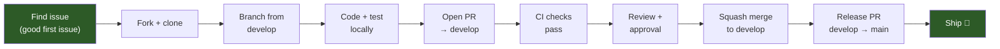

# Contributor Guide

> Welcome. This guide is for engineers contributing to the public Tricognita frontend. For setup basics, see `CONTRIBUTING.md`; for the bigger picture, see `ARCHITECTURE_OVERVIEW.md`. This document is the in-between: how to find work that fits, how we review, and what makes a contribution easy to merge.

## The 5-minute orientation

1. Read `README.md` (what this is).
2. `npm install && cp .env.example .env.local && npm run dev`.
3. Click around the local dashboard — the demo data is synthetic; nothing real connects.
4. Open `ARCHITECTURE_OVERVIEW.md` for the layout.
5. Look at the issue tracker for `good first issue` or `help wanted` labels.

If anything in those five minutes is broken, that itself is the perfect first contribution to fix.

## Contribution lifecycle



## Branch workflow

We use a `develop` integration branch. **All standard PRs target `develop`, not `main`.**

```bash
# Start your contribution
git checkout develop
git pull origin develop
git checkout -b feature/my-improvement

# Work on your change
# ...

# Commit with sign-off
git commit -s -m "feat(queue): add bulk select checkbox"

# Push and open PR → develop
git push origin feature/my-improvement
```

### Branch naming table

| Prefix | Use case | Example |
|---|---|---|
| `feature/` | New feature or enhancement | `feature/queue-bulk-actions` |
| `fix/` | Bug fix | `fix/incident-empty-state` |
| `docs/` | Documentation only | `docs/update-architecture` |
| `chore/` | Tooling, CI, dependencies | `chore/update-node-version` |
| `refactor/` | Code restructuring | `refactor/extract-queue-hooks` |
| `test/` | Adding or fixing tests | `test/auth-unit-tests` |

See [`docs/BRANCH_STRATEGY.md`](./docs/BRANCH_STRATEGY.md) for the full branch model.

## Where contributions have the highest leverage

### High leverage (we'll review fast and merge happily)

- **Bug fixes** with a clear repro.
- **Accessibility improvements** — anything that improves keyboard navigation, screen-reader output, or color contrast.
- **TypeScript tightening** — replacing `any` with proper types, narrowing `unknown`, eliminating type assertions.
- **Empty-state and error-state polish** — every primitive in `lib/ui/` has empty + error variants; pages should use them consistently.
- **Documentation clarifications** in the public `docs/` set.
- **Performance** — measurable improvements (page load, interaction latency, rendering hotspots) with a before/after.
- **Test additions** for currently-untested behavior.
- **Demo dataset richness** — adding more believable findings, attack paths, incidents that make the synthetic data feel more real.

### Lower leverage (often declined or asked to discuss first)

- New top-level features without a use case.
- Style-only refactors (whitespace, import order, file renames) without functional benefit.
- Removing existing functionality without prior discussion.
- "Best-practice" changes without an exploitable scenario behind them.
- Configuration changes (Tailwind, ESLint, TypeScript config) without strong rationale.

### Out of scope for this repo

- Anything that requires the private Go API to test (we'll work that on our side).
- Production deployment, infrastructure, or operational tooling (those live in the private engineering repo).
- Changes that add real customer references or production identifiers (see `OSS_SAFE.md`).

## Finding something to work on

Issue labels we use:

- `good first issue` — small, well-scoped, accepted in advance. Best place to start.
- `help wanted` — larger work we'd accept contributions for but haven't prioritized internally.
- `discussion` — open question; comment before opening a PR.
- `documentation` — docs only, often a quick contribution.
- `accessibility` — a11y improvements; we always want these.
- `type-safety` — TS tightening.

If you don't see an issue that fits but have an idea, **open a discussion or an issue first**. The cost of writing a PR for an idea we'd decline is high for both sides; the cost of a one-paragraph proposal is low.

## How we review

We aim for first response within 3 business days. Reviews tend to focus on:

1. **Does it solve a real problem?** — described in the linked issue.
2. **Does it match existing patterns?** — consistency with the file you're editing.
3. **Is it the smallest change that solves the problem?** — we prefer focused PRs.
4. **Does it preserve the security and tenant boundaries?** — the three load-bearing patterns in `ARCHITECTURE_OVERVIEW.md`.
5. **Does it build cleanly?** — `tsc`, `lint`, `build` all pass.
6. **Are commit messages informative?** — see "commit hygiene" below.

We don't bike-shed on style; the linter handles it. We do push back on premature abstraction, scope creep, and changes that contradict the public/private boundary in `OSS_SAFE.md`.

## Commit hygiene

The repository uses single-commit PRs (squash merges). Commit messages should be:

- **Subject line ≤ 72 chars**, imperative mood: "fix queue rendering when filter is empty" not "fixed queue".
- **Body explains why**, not what (the diff explains what).
- **Reference the issue** if there is one.
- **Include DCO sign-off** (`git commit -s`).

Example:

```
fix(queue): empty filter shouldn't render an unfiltered list

When the kind filter is set to "incident" and there are no incidents,
the queue previously fell back to rendering all items. The filter
function returned [] for the wrong reason. Closes #142.

Signed-off-by: Jane Doe <jane@example.com>
```

## DCO sign-off

We use the [Developer Certificate of Origin](https://developercertificate.org/) to certify that contributors have the right to submit their code. Add the `-s` flag to your commits:

```bash
git commit -s -m "feat(queue): add bulk actions"
```

This is currently advisory (PRs without sign-off won't be blocked), but all contributors are encouraged to sign off.

## Code style we expect

- TypeScript strict mode end-to-end. No `any`. Use `unknown` and narrow.
- React Compiler purity rules apply (no `Date.now()` / `Math.random()` in render).
- Functional components only. Class components are explicitly disallowed.
- Prefer pure functions for derivation logic (see `lib/lifecycle.ts` for the pattern).
- No new comments unless the *why* is non-obvious. The code explains the *what*.
- New components should be in `lib/ui/` if reusable, in the route's `components/` directory if specific.

## Demo data and synthetic content rules

- Anything that resembles customer data must be obviously synthetic.
- Use `DEMO_` or `EXAMPLE_` prefixes on identifiers.
- Use AWS canonical-placeholder account IDs (`123456789012`) and `@example.com` emails.
- See `PUBLIC_REPO_SCOPE.md §6` for the full list.

## Testing

We don't have a comprehensive test suite (yet). Adding tests is welcomed:

- TypeScript type tests for `lib/` modules.
- Component tests for primitives in `lib/ui/`.
- Route handler tests for `app/api/`.

Until then, manual verification + `tsc` + `lint` + `build` is the bar.

## What happens after merge

Your PR is squash-merged into `develop`. When `develop` is stable and ready for release, a maintainer creates a release PR from `develop` → `main`. After review and CI, merging to `main` triggers production deployment.

Your name shows up in the GitHub contributor graph. If your work meaningfully shipped a feature or fixed a notable bug, you're welcome (encouraged) to mention it on your own channels — we appreciate the visibility.

See [`docs/RELEASE_PROCESS.md`](./docs/RELEASE_PROCESS.md) for the full release process.

## Architecture navigation

New to the codebase? Follow this path:

1. [`ARCHITECTURE_OVERVIEW.md`](./ARCHITECTURE_OVERVIEW.md) — how the system is designed
2. [`docs/CONTRIBUTOR_ARCHITECTURE_MAP.md`](./docs/CONTRIBUTOR_ARCHITECTURE_MAP.md) — visual map with safe zones
3. [`docs/BRANCH_STRATEGY.md`](./docs/BRANCH_STRATEGY.md) — branch workflow
4. [`docs/SECURITY_ARCHITECTURE.md`](./docs/SECURITY_ARCHITECTURE.md) — auth + tenant model

## Reporting a security vulnerability

**Do not** open a public issue. See `SECURITY.md`. The short version: email `security@tricognita.com` or use a private GitHub Security Advisory. We respond within 2 business days.

## Asking questions

- Open a GitHub Discussion for open-ended questions.
- Open an Issue if it's likely actionable.
- For private/sensitive questions, email the founder.

We are a small team and the founder reads every issue. Patience helps; persistence is fine; quality questions get quality answers.

## Thanks

Open-source contributions to a security platform are non-trivial — the bar for code quality, accuracy, and care is higher than typical. We notice and appreciate the effort. Thanks for being here.
