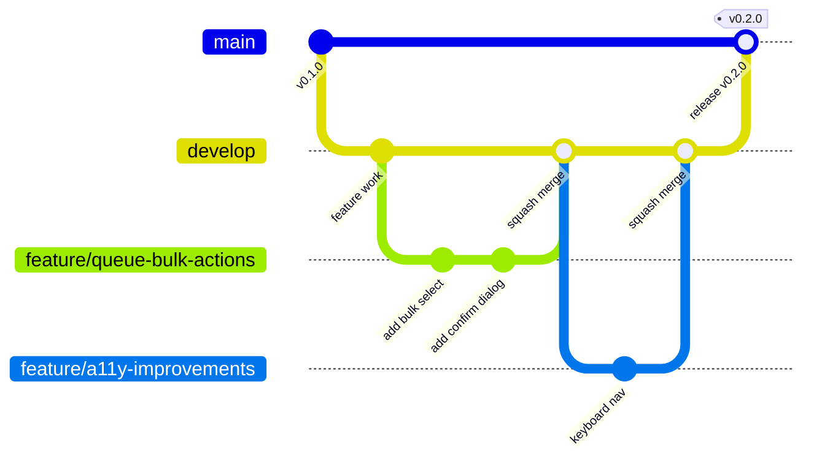

# Branch Strategy

> Last reviewed: 2026-05-25
>
> This document defines how code flows from idea to production in the
> Tricognita public repository. It is the authoritative reference for
> contributors and maintainers.

## Branch model



## Branches

| Branch | Purpose | Protected | Deploy target |
|---|---|---|---|
| `main` | Production-ready code. Every commit is releasable. | ✅ Yes | Production (Vercel auto-deploy + Fly.io backend) |
| `develop` | Integration branch. Feature PRs merge here first. | ✅ Yes | Preview (Vercel preview deploys) |
| `feature/*` | New features or enhancements. | No | None |
| `fix/*` | Bug fixes. | No | None |
| `docs/*` | Documentation-only changes. | No | None |
| `chore/*` | Tooling, CI, dependency updates. | No | None |
| `release/*` | Release preparation (changelog, version bump). | No | None |
| `hotfix/*` | Emergency production fixes. | No | None |

## Workflow

### Standard feature flow

```
feature/* ──PR──▶ develop ──PR──▶ main
```

1. **Branch** from `develop` with a descriptive name:
   ```bash
   git checkout develop
   git pull origin develop
   git checkout -b feature/queue-bulk-actions
   ```

2. **Work** on the feature. Commit with clear messages using conventional-commit style:
   ```bash
   git commit -m "feat(queue): add bulk select checkbox to queue items"
   ```

3. **Push** and open a PR targeting `develop`:
   ```bash
   git push origin feature/queue-bulk-actions
   # Open PR: feature/queue-bulk-actions → develop
   ```

4. **Review**: CI must pass. At least 1 approving review required.

5. **Merge**: Squash-merge into `develop`. The squash commit message should summarize the PR.

6. **Release**: When `develop` is stable and ready for production, a maintainer opens a PR from `develop` → `main`. After review and CI, merge to `main` triggers production deployment.

### Hotfix flow

```
hotfix/* ──PR──▶ main ──cherry-pick──▶ develop
```

For critical production fixes that cannot wait for the normal release cycle:

1. Branch from `main`:
   ```bash
   git checkout main
   git pull origin main
   git checkout -b hotfix/fix-session-validation
   ```

2. Fix the issue with a minimal, focused change.

3. Open PR targeting `main` directly. Founder review required.

4. After merge to `main`, cherry-pick the fix back to `develop`:
   ```bash
   git checkout develop
   git cherry-pick <commit-hash>
   git push origin develop
   ```

### Documentation-only flow

Documentation PRs follow the standard flow but may optionally target `main` directly if they:
- Fix a typo or broken link in existing docs
- Update outdated information
- Do not change any code

### Release flow

See [`RELEASE_PROCESS.md`](./RELEASE_PROCESS.md) for the full release process.

## Branch naming conventions

| Prefix | Use case | Example |
|---|---|---|
| `feature/` | New features, enhancements | `feature/queue-bulk-actions` |
| `fix/` | Bug fixes | `fix/incident-empty-state` |
| `docs/` | Documentation only | `docs/update-architecture-overview` |
| `chore/` | Tooling, CI, deps, cleanup | `chore/update-eslint-config` |
| `release/` | Release preparation | `release/v0.2.0` |
| `hotfix/` | Emergency production fix | `hotfix/fix-session-validation` |
| `refactor/` | Code restructuring (no behavior change) | `refactor/extract-queue-hooks` |
| `test/` | Adding or fixing tests | `test/add-auth-unit-tests` |

### Naming rules

- Use lowercase with hyphens: `feature/queue-bulk-actions` not `feature/QueueBulkActions`
- Be descriptive but concise
- Include the component area when possible: `fix/queue-empty-state` not `fix/empty-state`
- No personal names or ticket numbers in branch names

## Merge rules

| Target | Strategy | Reviews required | Status checks |
|---|---|---|---|
| `develop` | Squash merge | 1 approval | CI (lint, test, build, tsc) |
| `main` | Squash merge | 1 approval + founder | CI + Frontend PR Check |

### Why squash merge?

- Clean, linear history on protected branches
- Each merge commit tells a complete story
- Easier to revert individual changes
- Contributor's branch history preserved in the PR for audit

## Review expectations

### For contributors

- Fill the PR template completely
- Ensure all CI checks pass before requesting review
- Respond to review feedback within 5 business days
- Keep PRs focused — one logical change per PR

### For reviewers

- First response within 3 business days
- Focus on correctness, security boundaries, and pattern consistency
- Don't bike-shed on style (the linter handles it)
- Approve or request changes — don't leave PRs in limbo

## What NOT to do

- ❌ Push directly to `main` or `develop`
- ❌ Force-push to protected branches
- ❌ Merge without CI passing
- ❌ Merge without required reviews
- ❌ Create long-lived feature branches (merge frequently)
- ❌ Target `main` for standard feature PRs (use `develop`)
