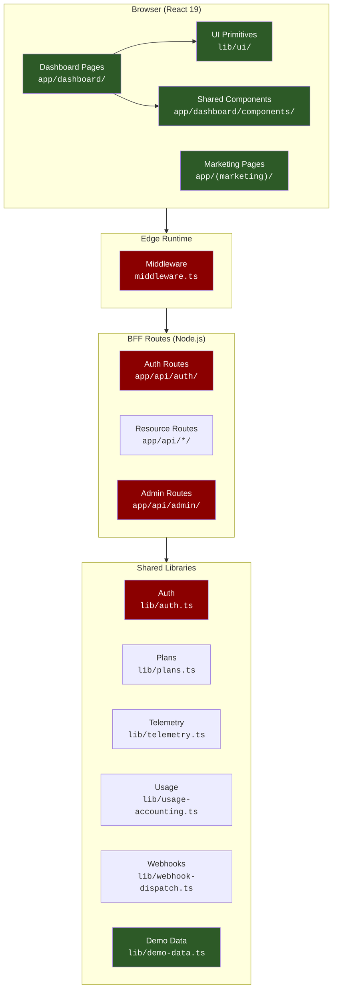
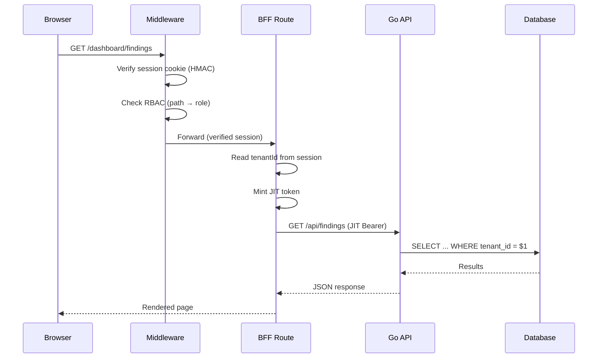

# Contributor Architecture Map

> A visual guide to help new contributors navigate the Tricognita frontend
> codebase. Read this alongside [`ARCHITECTURE_OVERVIEW.md`](../ARCHITECTURE_OVERVIEW.md)
> for the technical deep dive.

## System overview



**Legend:**
- 🟢 Green = **Contributor-safe zones** — PRs welcome without founder review
- 🔴 Red = **Founder-required zones** — changes require `@NITHISH282620` review (enforced by CODEOWNERS)

---

## Directory structure at a glance

```
frontend/
├── app/                          # Next.js App Router
│   ├── (marketing)/              # 🟢 Public marketing pages
│   ├── dashboard/                # 🟢 Authenticated dashboard
│   │   ├── admin/                # 🟢 Admin-only pages (UI)
│   │   ├── components/           # 🟢 Dashboard-specific components
│   │   ├── findings/             # 🟢 Findings page
│   │   ├── incidents/            # 🟢 Incidents page
│   │   ├── queue/                # 🟢 Queue page
│   │   ├── soc/                  # 🟢 SOC page
│   │   └── ...                   # 🟢 Other feature pages
│   ├── api/                      # 🔴 BFF routes (founder required)
│   │   ├── auth/                 # 🔴 Auth routes (founder required)
│   │   └── .../                  # 🔴 Resource routes
│   ├── login/                    # 🟢 Login page
│   └── onboarding/               # 🟢 Onboarding page
├── lib/                          # Shared libraries
│   ├── ui/                       # 🟢 UI primitives
│   ├── auth.ts                   # 🔴 Session signing (founder required)
│   ├── jit-token.ts              # 🔴 JIT tokens (founder required)
│   ├── rbac.ts                   # 🔴 RBAC (founder required)
│   ├── role-utils.ts             # 🔴 Role utilities (founder required)
│   ├── token-store.ts            # 🔴 Token store (founder required)
│   ├── plans.ts                  # 🟢 Plan catalog
│   ├── telemetry.ts              # 🟢 Telemetry events
│   ├── demo-data.ts              # 🟢 Demo dataset
│   └── ...                       # 🟢 Other libs
├── middleware.ts                  # 🔴 Edge middleware (founder required)
├── docs/                         # 🟢 Public documentation
├── public/                       # 🟢 Static assets
└── package.json                  # 🔴 Dependencies (founder required)
```

---

## "Where do I add X?" quick reference

| I want to... | Where | Example |
|---|---|---|
| Add a new dashboard page | `app/dashboard/<feature>/page.tsx` | `app/dashboard/compliance/page.tsx` |
| Add a new marketing page | `app/(marketing)/<page>/page.tsx` | `app/(marketing)/pricing/page.tsx` |
| Add a reusable UI component | `lib/ui/<ComponentName>.tsx` | `lib/ui/ProgressBar.tsx` |
| Add a dashboard-specific component | `app/dashboard/components/<Name>.tsx` | `app/dashboard/components/FindingCard.tsx` |
| Add a utility function | `lib/<module>.ts` | `lib/format-date.ts` |
| Add demo data | `lib/demo-data.ts` | Add entries to existing arrays |
| Add documentation | `docs/<TOPIC>.md` | `docs/PAGINATION.md` |
| Fix a bug in a page | `app/dashboard/<feature>/page.tsx` | Edit the existing file |
| Improve accessibility | Wherever the component lives | Add `aria-*` attrs, keyboard handlers |
| Add type definitions | `lib/types/<domain>.ts` | `lib/types/compliance.ts` |

### Things you should NOT add without founder discussion

| I want to... | Why it needs discussion |
|---|---|
| Add a new BFF route (`app/api/`) | Routes call the Go API; security boundary |
| Change auth logic | Session signing, RBAC, tenant isolation |
| Modify middleware | Edge-layer security enforcement |
| Change `package.json` dependencies | Supply chain risk |
| Change Next.js config | CSP, security headers, build config |
| Change ESLint or TypeScript config | Project-wide impact |

---

## Contributor-safe zones (detailed)

These are the paths where external contributors can work freely. PRs touching only these paths do not require founder review (peer review is sufficient):

### Dashboard pages (`app/dashboard/`)

- Each feature has its own directory: `findings/`, `incidents/`, `queue/`, `soc/`, `executive/`, etc.
- Pages follow the pattern: `<PageShell>` → `<HStack>` → `<KPI>` → `<Card>` → `<Table>`
- Use existing UI primitives from `lib/ui/`

### UI primitives (`lib/ui/`)

- `Button`, `Card`, `Table`, `Badge`, `Stat`, `KPI`, `Skeleton`, `EmptyState`, `ErrorState`
- `FilterBar`, `Timeline`, `StatusDot`, `PageShell`, `Section`, `Stack`, `DegradedBanner`
- New primitives are welcome — follow the existing pattern

### Marketing pages (`app/(marketing)/`)

- Trust center, how-it-works, audience pages, lead capture forms
- Standalone pages that don't touch auth or BFF routes

### Documentation (`docs/`)

- Public documentation only
- Architecture, security, workflow, integration, pricing docs
- Must not include operational internals (see `OSS_SAFE.md`)

### Demo data (`lib/demo-data.ts`)

- Synthetic dataset for local development
- Must use `DEMO_` / `EXAMPLE_` prefixes
- Must use `@example.com` emails and `123456789012` AWS account IDs

### Styles and static assets

- `app/globals.css`, component-level styles
- `public/` static assets (images, icons)

---

## Data flow for a typical page



Understanding this flow helps you:
- Know where UI bugs live (Browser layer)
- Know where data-fetching bugs live (BFF layer)
- Know why you can't change auth logic without founder review

---

## First contribution walkthrough

1. **Find an issue**: Look for `good first issue` or `help wanted` labels
2. **Fork and clone**: `git clone <your-fork>`
3. **Set up**: `cd frontend && npm install && cp .env.example .env.local && npm run dev`
4. **Branch**: `git checkout develop && git checkout -b fix/my-first-fix`
5. **Code**: Make your change in the contributor-safe zones
6. **Verify**: `npx tsc --noEmit && npm run lint && npm run build`
7. **Commit**: `git commit -s -m "fix(queue): description of change"`
8. **Push & PR**: Target `develop`, fill the PR template
9. **Review**: Respond to feedback within 5 business days
10. **Celebrate**: Your first OSS contribution to an enterprise security platform 🎉

---

## Related documents

- [`ARCHITECTURE_OVERVIEW.md`](../ARCHITECTURE_OVERVIEW.md) — technical architecture deep dive
- [`CONTRIBUTING.md`](../CONTRIBUTING.md) — setup and PR process
- [`CONTRIBUTOR_GUIDE.md`](../CONTRIBUTOR_GUIDE.md) — what to work on, how we review
- [`OSS_SAFE.md`](../OSS_SAFE.md) — public/private boundary
- [`docs/BRANCH_STRATEGY.md`](./BRANCH_STRATEGY.md) — branch workflow
