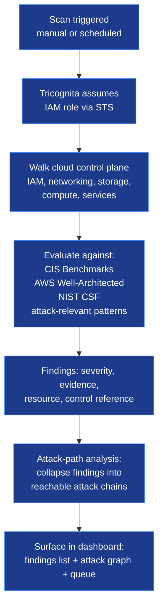
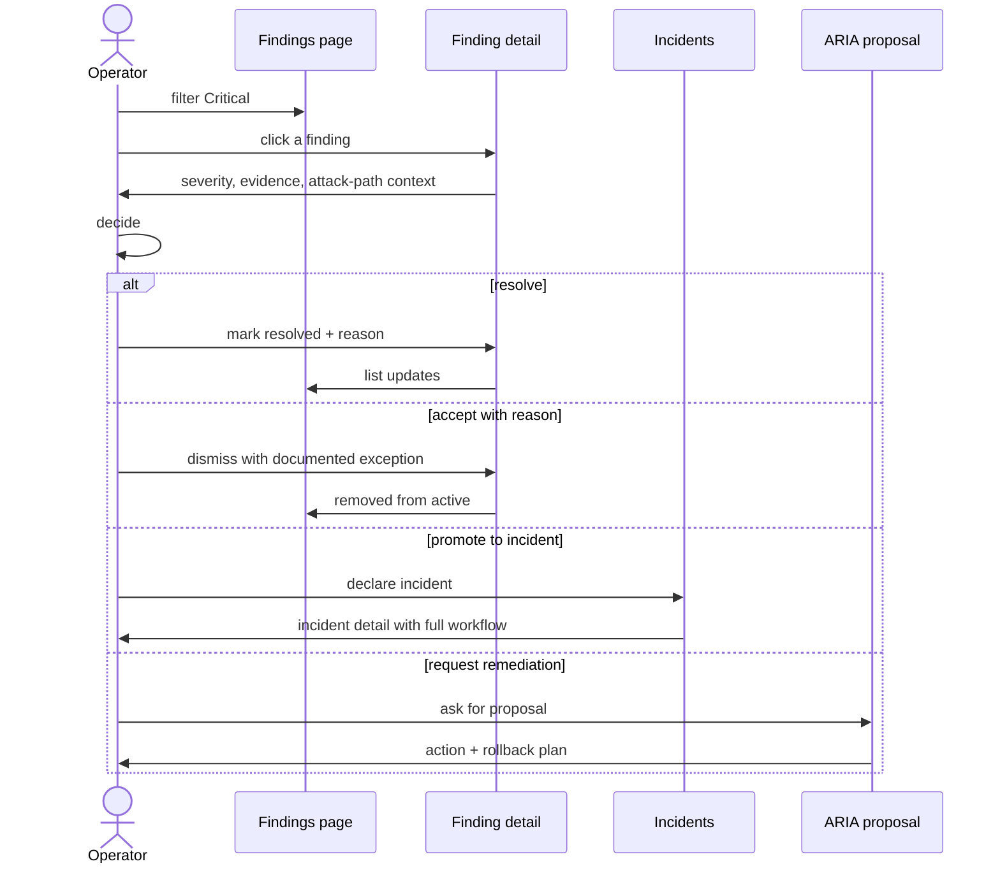
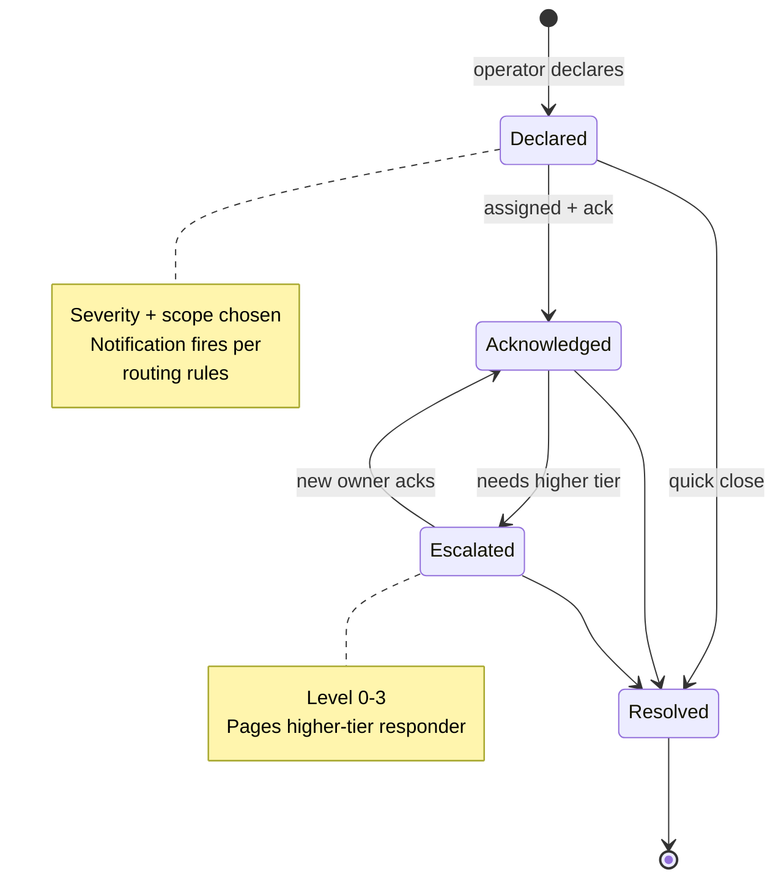
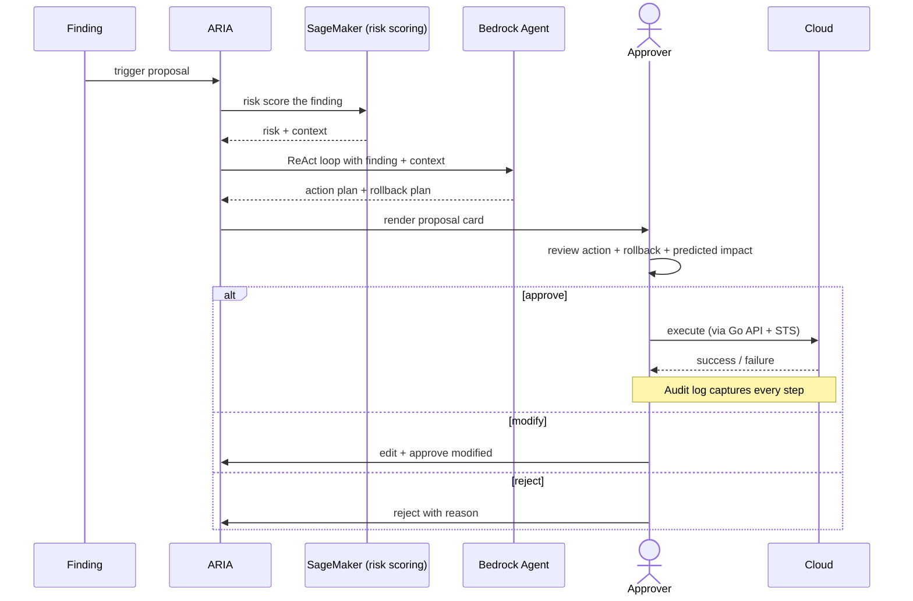
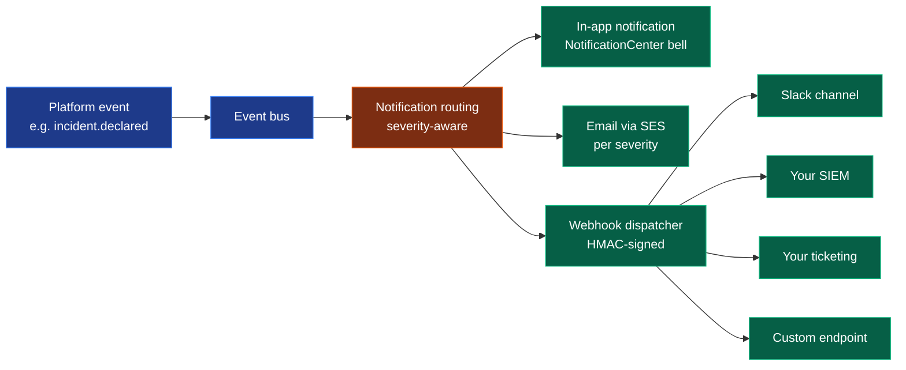
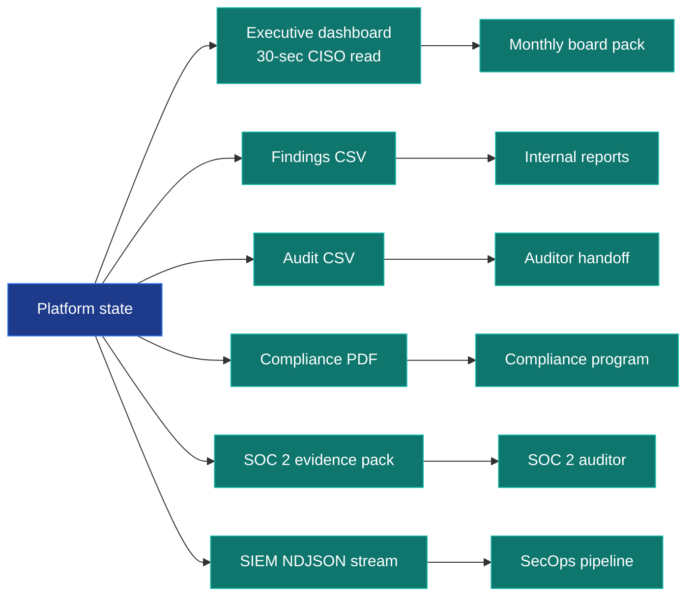
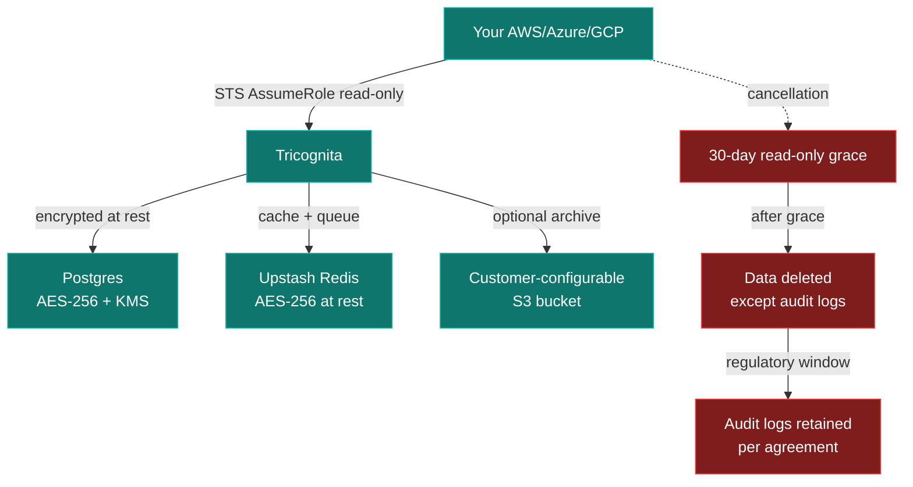
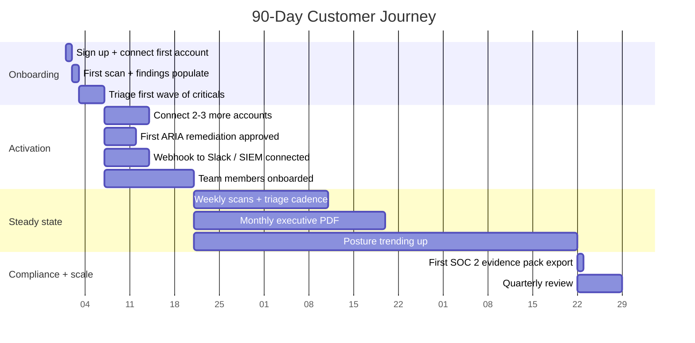

# How Tricognita Works

> Plain-English end-to-end walkthrough. Suitable for a security leader, board member, or technical evaluator who wants to understand the platform without reading code.

## The 60-second version

Tricognita is a multi-tenant cloud security platform. You grant us read-only access to your AWS / Azure / GCP environments via IAM federation. We scan continuously for posture misconfigurations and reachable attack paths. When we find something that matters, we route it through an incident workflow your team can triage. Our ARIA engine proposes specific remediation actions — including rollback plans — that your team approves before anything executes. Reporting and integrations close the loop.

The architecture is multi-tenant from the first commit, the frontend is open-source so you can verify our security claims, and our pricing is structured for security teams of 5-500 people who've outgrown native cloud tools but can't justify enterprise CSPM pricing.

## What happens when you sign up

**Time from sign-up to first findings: typically 15-30 minutes.**

You apply a CloudFormation template that creates a read-only IAM role with a trust policy allowing Tricognita to assume it. You paste the role ARN into our UI. We use AWS STS to assume the role for each scan — no long-lived credentials cross the boundary.

For Azure and GCP, the equivalent OIDC / workload-identity federation patterns apply.

## What happens during a scan

We're not "scanning your VMs" — we're reading your cloud control plane (IAM, networking, storage configuration, etc.) and evaluating it against frameworks. Then we compute reachability across IAM + network + resource policy to find which findings chain into actual attack paths.

A public S3 bucket alone is a finding. The same bucket reachable through a Lambda with admin IAM is an incident. The attack graph collapses 47 findings into 6 reachable paths — that's the priority list.

## What happens when you triage a finding

Four standard outcomes for any finding. The workflow surface gives you all four from the same detail pane.

## What happens during an incident

Every state transition is audit-logged with the operator's email and timestamp. The activity timeline is the canonical handoff record between shifts.

Notifications route per severity per routing rules. Critical incidents fan out to email + in-app + webhook + (future) PagerDuty. Major to email + in-app + webhook. Minor to in-app + webhook. Info to in-app only.

For the full incident workflow detail see [`docs/WORKFLOW_ENGINE.md`](./WORKFLOW_ENGINE.md).

## What happens when ARIA proposes a remediation

The default is **MANUAL_APPROVAL**. Nothing changes in your environment without an explicit human approval. Autonomous mode exists for narrow well-understood patterns (e.g., "remove public-access ACL on storage bucket") and is opt-in per tenant — most pilots stay in MANUAL_APPROVAL for their entire engagement.

Every proposal includes a **rollback plan** as a first-class field. Most CSPM tools propose actions without rollback; we don't.

## What happens with integrations

Webhooks are signed with HMAC-SHA256 using a Stripe-style format. Your verifier rejects signatures with timestamp older than 5 minutes (replay defense). Failed deliveries retry on a documented schedule (30s, 5m, 30m, 2h — max 5 attempts) before dead-letter.

For the full integration contract see [`docs/INTEGRATIONS.md`](./INTEGRATIONS.md).

## What happens with reporting

The executive dashboard is the 30-second CISO read: posture trend, incident MTTR, remediation throughput. Exports cover the formats auditors actually ask for. The SIEM NDJSON stream is the integration most security teams want to replace their current spreadsheet-based reporting.

## What happens to your data

- **Encryption at rest:** AES-256 across Postgres (Neon-managed), Redis (Upstash-managed), S3.
- **Encryption in transit:** TLS 1.2+ everywhere, HSTS preload-eligible.
- **Long-lived credentials:** never. Customer access via STS AssumeRole only.
- **Data deletion on cancellation:** 30-day grace, then full deletion. Audit logs retained per regulatory window. Deletion certificate provided on request.

For the full data handling commitment see [`docs/SECURITY_REVIEW.md`](./SECURITY_REVIEW.md) and [`docs/TELEMETRY_GOVERNANCE.md`](./TELEMETRY_GOVERNANCE.md).

## What we DON'T do

Stating these explicitly is part of the trust posture.

| Capability | Status |
|---|---|
| Autonomous remediation by default | No — MANUAL_APPROVAL is default; autonomous is opt-in per narrow patterns |
| Browser-extension footprint | No — we don't install anything on your endpoints |
| Agent-based scanning | No — IAM federation only |
| Third-party analytics SDKs | No — no Segment / Mixpanel / Amplitude / similar loaded in browser |
| PII collection | No — only a one-way truncated SHA-256 of email for telemetry |
| Long-lived customer credentials | No — STS AssumeRole every call |
| SOC 2 Type II | Not yet — in progress with external auditor |
| HIPAA / PCI / FedRAMP | Not in scope today |
| BYOK / Customer-managed KMS | Not yet — platform-managed today; roadmap |
| 24/7 on-call | Not yet — best-effort overnight; business-hours primary |
| Multi-region active-active | Not yet — single-region today |
| Self-hosted / on-premise | Not in scope today |

## How a typical 90-day journey looks

Most pilots reach "steady state" within 3 weeks. Most paid customers see meaningful posture trend within 90 days.

## Where to dig in

| You're a... | Read this next |
|---|---|
| Security leader evaluating us | [`docs/SECURITY_REVIEW.md`](./SECURITY_REVIEW.md) + [`docs/PROCUREMENT_FAQ.md`](./PROCUREMENT_FAQ.md) |
| Engineer evaluating the codebase | [`docs/architecture/SYSTEM_OVERVIEW.md`](./architecture/SYSTEM_OVERVIEW.md) |
| Investor / advisor | [`docs/FOUNDING_STORY.md`](./FOUNDING_STORY.md) + [`docs/EXECUTIVE_SUMMARY.md`](./EXECUTIVE_SUMMARY.md) |
| Customer success / procurement | [`docs/PRICING_MODEL.md`](./PRICING_MODEL.md) |
| Contributor | [`CONTRIBUTOR_GUIDE.md`](../CONTRIBUTOR_GUIDE.md) + [`docs/CODEBASE_GUIDE.md`](./CODEBASE_GUIDE.md) |
| Academic / researcher | [`docs/UNIVERSITY_SHOWCASE.md`](./UNIVERSITY_SHOWCASE.md) |

Last reviewed: 2026-05-23 (Phase 23).
