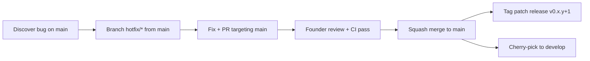

# Release Process

> Last reviewed: 2026-05-25
>
> How Tricognita cuts releases from the public repository. This document
> covers versioning, the release checklist, changelog discipline, and
> rollback expectations.

## Versioning

Tricognita follows [Semantic Versioning 2.0.0](https://semver.org/spec/v2.0.0.html) with pre-1.0 caveats.

### Pre-1.0 rules

While the project is pre-1.0 (`0.x.y`):

| Version bump | Meaning | Example |
|---|---|---|
| `0.x.0` → `0.(x+1).0` | Feature release. May include breaking changes. | `0.1.0` → `0.2.0` |
| `0.x.y` → `0.x.(y+1)` | Bug fix release. No breaking changes. | `0.1.0` → `0.1.1` |

### Post-1.0 rules (future)

Once `1.0.0` ships (first GA enterprise tier):

| Version bump | Meaning |
|---|---|
| Major (`x.0.0`) | Breaking changes to public API, auth contract, or configuration |
| Minor (`0.x.0`) | New features, backward-compatible |
| Patch (`0.0.x`) | Bug fixes, security patches, doc corrections |

## Release cadence

- **Monthly minimum** during pilot phase
- **Weekly** during active development windows
- **Ad hoc** for security patches (immediate)

## Stable release philosophy

> Every commit on `main` is a releasable commit.

This means:
- `main` is never broken
- `main` is always deployable
- `develop` may be temporarily broken during integration
- Feature branches may be incomplete

The release process is about **tagging a point on `main`** and writing a changelog — not about stabilizing code. Stabilization happens on `develop` before merging to `main`.

---

## Release checklist

### Pre-release (on `develop`)

- [ ] All planned features merged to `develop`
- [ ] CI passes on `develop` (`tsc`, `lint`, `build`, `test`)
- [ ] No open `P0` or `P1` bugs targeting this release
- [ ] OSS safety scan: no production identifiers, real emails, or operational leakage
- [ ] Dependencies reviewed (Dependabot PRs addressed)
- [ ] `CHANGELOG.md` updated with `[Unreleased]` section filled in

### Release PR (`develop` → `main`)

- [ ] Create PR from `develop` → `main`
- [ ] PR title: `release: v0.x.y`
- [ ] PR body includes release notes summary
- [ ] All CI checks pass
- [ ] Founder approves the PR
- [ ] Squash merge to `main`

### Post-merge (on `main`)

- [ ] Create annotated git tag:
  ```bash
  git checkout main
  git pull origin main
  git tag -a v0.x.y -m "Release v0.x.y — <one-line summary>"
  git push origin v0.x.y
  ```
- [ ] Verify Vercel production deployment succeeded
- [ ] Verify Fly.io backend deployment succeeded (if backend changes)
- [ ] Verify production health (`/healthz` returns 200)
- [ ] Create GitHub Release from the tag (copy changelog entry)
- [ ] Move `[Unreleased]` in CHANGELOG.md to the new version header

---

## Changelog discipline

The changelog follows [Keep a Changelog](https://keepachangelog.com/en/1.1.0/).

### What to include

| Category | Include |
|---|---|
| **Added** | New user-visible features |
| **Changed** | Behavior changes worth noting |
| **Fixed** | Bug fixes worth noting |
| **Security** | Security-relevant changes (always disclose) |
| **Deprecated** | Features scheduled for removal |
| **Removed** | Features actually removed |

### What NOT to include

- Internal refactors with no user-visible effect
- CI/CD pipeline changes (unless they affect contributors)
- Dependency bumps (unless security-relevant)
- Code style changes

### How to write entries

- Write from the user's perspective, not the developer's
- Start with a verb: "Add", "Fix", "Remove", "Change"
- Reference the PR or issue number
- Be specific enough to be useful, general enough to be readable

**Good:** `Fix queue rendering when the kind filter is set to "incident" and there are no incidents (#142)`

**Bad:** `Fixed a bug` or `Updated queue.tsx`

---

## Hotfix process

For critical production issues:



1. Branch `hotfix/*` from `main`
2. Minimal, focused fix only
3. PR targets `main` directly (founder review required)
4. After merge, tag a patch release
5. Cherry-pick the fix back to `develop`

---

## Rollback expectations

### When to rollback vs. hotfix

| Situation | Action |
|---|---|
| Feature has a bug but isn't critical | Hotfix on `develop`, release normally |
| Feature breaks production auth/security | Immediate revert PR to `main` |
| Feature breaks production rendering | Immediate revert PR to `main` |
| Deployment itself fails (Vercel/Fly) | Redeploy previous commit via platform UI |

### How to revert

```bash
# Find the merge commit to revert
git log --oneline -10

# Create a revert commit
git checkout main
git pull origin main
git checkout -b hotfix/revert-broken-feature
git revert <merge-commit-hash>
git push origin hotfix/revert-broken-feature

# Open PR targeting main, get founder review, merge
```

### Vercel rollback

Vercel supports instant rollback via the dashboard:
1. Go to **Vercel Dashboard → Deployments**
2. Find the last known-good deployment
3. Click **"Promote to Production"**

This is faster than a git revert for emergencies. The git revert should still follow to keep `main` accurate.

---

## Git tagging conventions

| Tag format | Meaning | Example |
|---|---|---|
| `v0.x.y` | Release tag | `v0.2.0` |
| No prefix | Not used | — |

Tags are **annotated** (not lightweight):

```bash
git tag -a v0.2.0 -m "Release v0.2.0 — bulk queue actions and a11y improvements"
```

### Who can create tags

Only the founder (repository admin) creates release tags. This is enforced by convention during pre-1.0; GitHub tag protection rules should be enabled for post-1.0.

---

## Related documents

- [`BRANCH_STRATEGY.md`](./BRANCH_STRATEGY.md) — branch naming, workflow, merge rules
- [`BRANCH_PROTECTION.md`](./BRANCH_PROTECTION.md) — GitHub settings configuration
- [`../CHANGELOG.md`](../CHANGELOG.md) — the changelog itself
- [`../ROADMAP.md`](../ROADMAP.md) — what's planned for future releases
