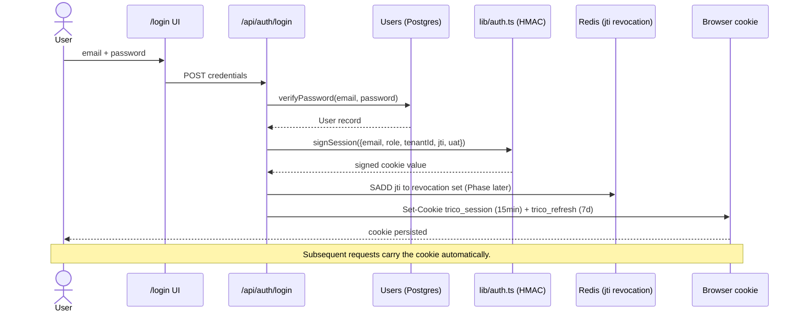
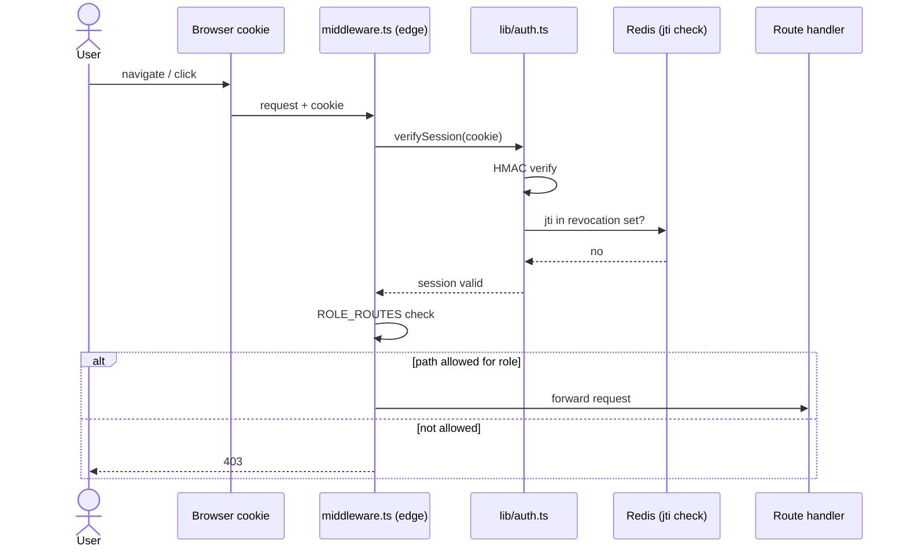
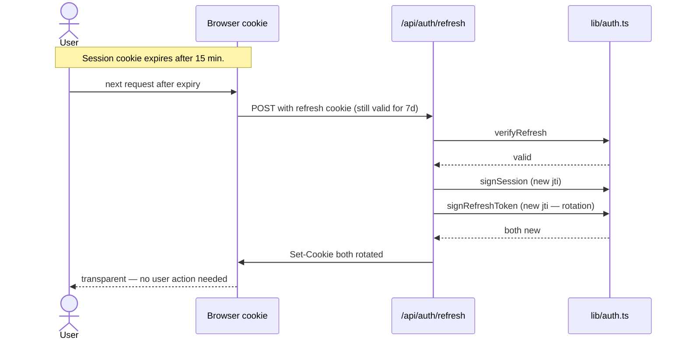
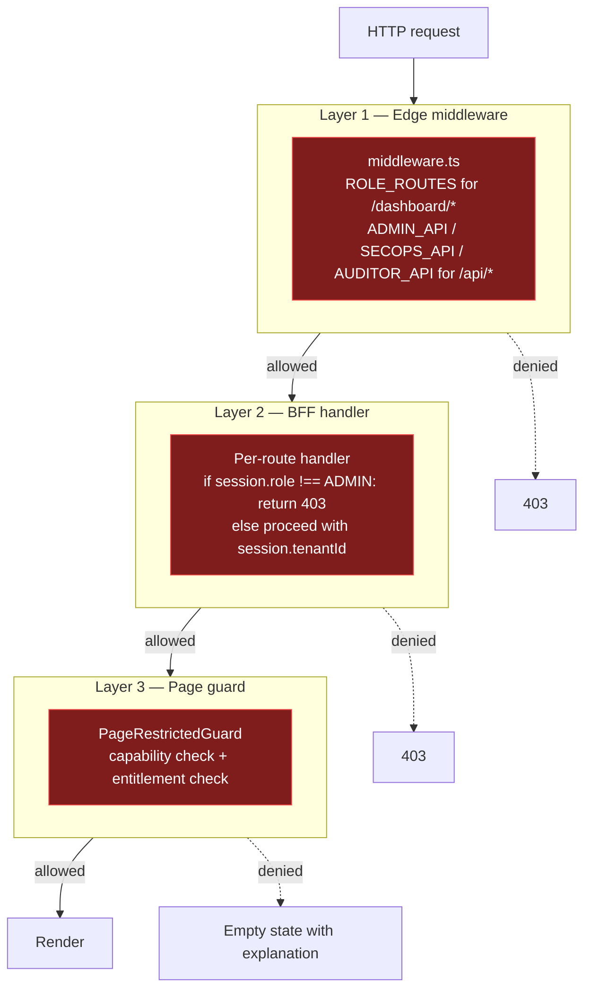
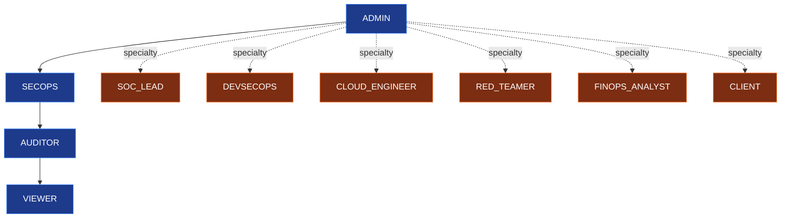
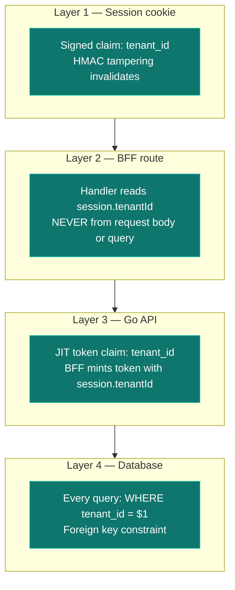
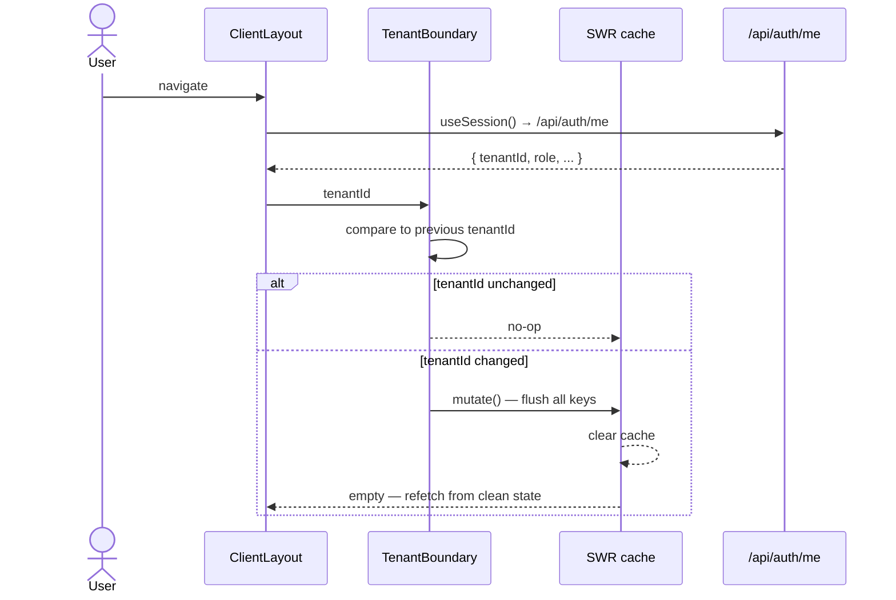
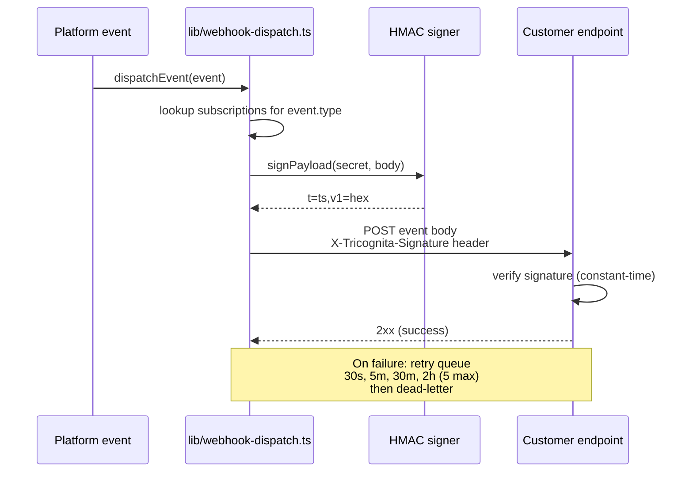

# Auth + Tenant Model

> How sessions are signed, how RBAC is enforced, and how tenant isolation works at four independent layers.

## Authentication flow (login → session)



**What's in the session payload:**

```ts
{
  email: string,        // user identity
  role: Role,           // ADMIN, SECOPS, AUDITOR, ...
  tenantId: string,     // tenant scope
  exp: number,          // Unix seconds expiry
  iat: number,          // issued-at
  jti: string,          // unique token id (revocation key)
  uat: string,          // SHA-256(userAgent, 16 chars) — client binding
}
```

**What's NOT in the session payload:**
- No plaintext password (obviously).
- No customer cloud credentials.
- No personally identifying data beyond email.

## Session verification on every request



Three checks happen at the edge before any handler runs:

1. **HMAC verification** — cookie tampering invalidates.
2. **Revocation check** — `jti` lookup in Redis revocation set (post-logout-everywhere).
3. **Role check** — path-prefix to allowed-roles via `ROLE_ROUTES`.

## Refresh-token rotation



**Refresh rotation is the design** — each refresh issues a new refresh token, invalidating the previous. A stolen refresh token can only be used until the legitimate user next refreshes.

The refresh cookie is scoped `Path=/api/auth/refresh` + `SameSite=Strict` — tighter than the session cookie's `SameSite=Lax`.

## Three-layer RBAC



**Why three layers and not one:**

- **Layer 1** rejects unauthorized requests before any application code runs (cheap, fast, broad).
- **Layer 2** enforces context-specific rules (e.g., "ADMIN of THIS tenant" vs "ADMIN of any tenant").
- **Layer 3** gives the user a recoverable empty state ("your plan doesn't include this") instead of a 403.

A bug in any one layer is contained by the other two.

## Role hierarchy



The linear hierarchy (ADMIN > SECOPS > AUDITOR > VIEWER) is for general escalation. Specialty roles (SOC_LEAD, DEVSECOPS, etc.) have explicit allow-lists per route — they don't inherit linearly.

## Tenant isolation — the four layers



**Why four independent layers:**

- A bug in the BFF (forgets to pass tenant) is caught by the Go API check.
- A bug in the Go API (accepts wrong tenant) is caught by the DB constraint.
- A compromised session cookie (forged tenant) fails at HMAC verification.
- All four would have to fail simultaneously for cross-tenant data leakage.

## Tenant isolation in the client cache



`<TenantBoundary />` in `app/dashboard/ClientLayout.tsx` is the client-side defense — even if the server side somehow served the wrong tenant's data once, the client cache is wiped on tenant transition.

## Admin-platform routes (intentionally cross-tenant)

A small set of admin routes operate at the platform level. They're documented in [`BOUNDARY_VERIFICATION.md`](../../docs/internal/BOUNDARY_VERIFICATION.md) (internal). The pattern:

| Route | Cross-tenant scope | Why |
|---|---|---|
| `/api/admin/incidents` | All platform incidents | Incidents are platform-level operational events |
| `/api/admin/exports/siem.ndjson` | Platform event feed | SIEM operator pull surface |
| `/api/admin/webhook-drain` | Platform retry queue | Cron-triggered queue maintenance |
| `/api/admin/health-aggregate` | Platform subsystems | No per-tenant data returned |
| `/api/admin/insights` | Platform telemetry aggregates | No raw events; counts only |
| `/api/admin/commercial` | Per-tenant plan + usage | Founder operating view |
| `/api/admin/leads` | Marketing leads | Founder operating view |
| `/api/admin/pilot-health` | Per-tenant risk | Founder operating view |
| `/api/admin/feedback` | Cross-tenant feedback | Founder triage view |

Properties common to all of these:

1. **ADMIN role required** (middleware + per-handler check).
2. **No customer asset data returned** — only aggregate counts, lifecycle stage, feedback envelopes (no message bodies cross tenant).
3. **Audit-logged** — every admin action is recorded.

## Webhook auth (outbound only)



We send webhooks; we never receive them. No inbound webhook endpoint exists to attack.

Customer-side verification example is in `docs/INTEGRATIONS.md`. The recommended pattern:
1. Reject signatures with timestamp older than 5 minutes (replay defense).
2. Use constant-time comparison on the signature.
3. Reject anything that fails either check; don't try to "recover."

## Production safety primitives

The auth + tenant model is the load-bearing security layer. Three commitments hold across every code change:

1. **Sessions are stateless to verify** but **revocable in real time** via Redis jti set.
2. **Tenant scope comes from the verified session**, never from the request body or query string.
3. **All cross-tenant admin routes** explicitly check `session.role !== "ADMIN"` per handler, on top of the middleware path-prefix gate.

These three are non-negotiable. Any change that weakens any of them should fail review.

Last reviewed: 2026-05-23 (Phase 23).
