# Dependency Map

> How `lib/` modules depend on each other, and which features pull which modules.

## Module dependency graph

```mermaid
graph BT
    subgraph Foundation["Foundation (no dependencies)"]
        env[env.ts]
        bff[bff-log.ts]
        cn[ui/cn.ts]
    end

    subgraph Auth["Auth + tenant"]
        auth[auth.ts]
        jit[jit-secret.ts]
        users[users.ts]
        rbac[rbac.ts]
    end

    subgraph Storage["Redis-backed stores"]
        feedback[feedback.ts]
        leads[leads.ts]
        incidents[incidents.ts]
        notif[notify.ts]
        webhook[webhook-dispatch.ts]
        telemetry[telemetry.ts]
        quota[tenant-quota.ts]
    end

    subgraph Commercial["Commercial layer"]
        plans[plans.ts]
        usage[usage-accounting.ts]
        lifecycle[lifecycle.ts]
    end

    subgraph DemoOps["Demo + operations"]
        demo[demo.ts]
        demoData[demo-data.ts]
        release[release.ts]
    end

    subgraph UI["UI primitives"]
        ui[ui/* primitives]
    end

    subgraph Hooks["Client hooks"]
        session[use-session.ts]
        fetcher[swr-fetcher.ts]
        refresh[session-refresh.ts]
    end

    auth --> env
    jit --> auth
    jit --> env
    users --> auth
    rbac --> auth

    feedback --> env
    leads --> env
    incidents --> env
    notif --> env
    webhook --> usage
    telemetry --> env
    quota --> env

    plans --> rbac
    usage --> env
    lifecycle --> usage

    demo --> env

    ui --> cn

    session --> auth
    refresh --> session

    classDef foundation fill:#374151,stroke:#9ca3af,color:#d1d5db
    classDef auth fill:#7f1d1d,stroke:#ef4444,color:#fff
    classDef storage fill:#7c2d12,stroke:#ea580c,color:#fff
    classDef commercial fill:#0f766e,stroke:#14b8a6,color:#fff
    classDef demoops fill:#1f2937,stroke:#6b7280,color:#d1d5db
    classDef uic fill:#1e3a8a,stroke:#3b82f6,color:#fff
    classDef hookc fill:#065f46,stroke:#10b981,color:#fff

    class env,bff,cn foundation
    class auth,jit,users,rbac auth
    class feedback,leads,incidents,notif,webhook,telemetry,quota storage
    class plans,usage,lifecycle commercial
    class demo,demoData,release demoops
    class ui uic
    class session,fetcher,refresh hookc
```

### Reading the graph

- **Arrows point from dependent → dependency.** `auth.ts → env.ts` means auth needs env.
- **Foundation layer** has no internal deps. Safe to import from anywhere.
- **Auth layer** is the security primitive — sits between foundation and everything tenant-aware.
- **Storage layer** modules are independent of each other (they share Redis but don't depend on each other's code), except `webhook-dispatch` which records usage.
- **Commercial layer** depends on `usage-accounting` for `lifecycle`, and on `rbac` for `plans`.
- **UI primitives** depend only on `cn.ts` — no business logic.
- **Hooks** are client-side and depend on auth contract for session shape.

## Feature → library matrix

| Feature | Primary libraries used |
|---|---|
| Login / register | `auth.ts`, `users.ts`, `env.ts`, `bff-log.ts` |
| Session middleware | `auth.ts`, `env.ts` |
| Findings page | `bff-log.ts`, `swr-fetcher.ts`, `ui/*` |
| Attack graph | `swr-fetcher.ts`, `ui/*` + xyflow |
| Incidents | `incidents.ts`, `notification-routing.ts`, `notify.ts`, `webhook-dispatch.ts`, `telemetry.ts`, `usage-accounting.ts` |
| SOC dashboard | `incidents.ts`, `notify.ts`, `swr-fetcher.ts`, `ui/*` |
| Queue | `incidents.ts`, `swr-fetcher.ts`, `ui/*` |
| Executive view | `swr-fetcher.ts`, `ui/*` |
| Plan + usage | `plans.ts`, `usage-accounting.ts`, `lifecycle.ts`, `users.ts` |
| Exports | `usage-accounting.ts` (counter), `ui/*` |
| Webhook dispatch | `webhook-dispatch.ts`, `usage-accounting.ts`, `notify.ts` |
| Telemetry tracker | `telemetry.ts`, `use-session.ts` |
| Feedback widget | `feedback.ts`, `use-session.ts`, `telemetry.ts` |
| Guided tour | `use-session.ts` |
| Lead capture | `leads.ts`, `env.ts` |
| Demo mode | `demo.ts`, `demo-data.ts`, `env.ts` |
| Admin operations | `quota.ts`, Go API health check |
| Admin commercial | `plans.ts`, `usage-accounting.ts`, `lifecycle.ts`, `users.ts` |
| Admin pilot health | `plans.ts`, `usage-accounting.ts`, `lifecycle.ts`, `feedback.ts`, `users.ts` |
| Admin insights | `telemetry.ts`, `feedback.ts` |
| Admin leads | `leads.ts` |
| Admin feedback | `feedback.ts`, `telemetry.ts` |

## Important non-dependencies

These are intentional separations:

| What | What doesn't import what | Why |
|---|---|---|
| `lib/ui/*` does NOT import `lib/auth.ts` or any business module | UI primitives are pure presentation | Composable + testable in isolation |
| `lib/telemetry.ts` does NOT import `lib/feedback.ts` or vice versa | Different consumers, different governance | Could be swapped independently |
| `lib/plans.ts` does NOT import `lib/usage-accounting.ts` | Catalog vs metering | Plans are data; usage is signal — separate concerns |
| `lib/demo.ts` does NOT import `lib/demo-data.ts` | Demo flag vs demo content | Server-side flag + client-side content |
| `lib/lifecycle.ts` does NOT import Redis directly | Pure function on usage-history input | Testable in isolation; same input → same output |

## Circular-dependency check

The current dependency graph is a DAG (directed acyclic). No circular imports exist. If you're considering one, the answer is usually to extract a shared module or pass the dependency as a parameter.

## When you add a new lib module

Follow these rules:

1. **Depend on the smallest surface possible.** If you only need `env.ts`, import only `env.ts`.
2. **Don't depend on UI primitives from business logic.** Business logic should be UI-agnostic.
3. **If you write a Redis client, model it after `lib/feedback.ts`** — singleton client, fail-open on Redis-unavailable, TTL on appropriate keys.
4. **If you emit telemetry, do it from the server side** unless the event is client-originating (page_view, notification interaction).
5. **If you take `tenantId` as a parameter, make sure the caller passes `session.tenantId` from a verified session** — never from request body.

## Module ownership (for contributors)

Modules with significant ongoing development:

| Module | Owner stability | Recommended for first contribution? |
|---|---|---|
| `ui/*` | Stable surface | Yes — adding a new primitive is welcomed |
| `auth.ts`, `rbac.ts` | Critical, evolves carefully | No — discuss first |
| `telemetry.ts` | Stable taxonomy, additions OK | Yes — adding an event type is a good first PR |
| `plans.ts`, `lifecycle.ts` | Stable, additions OK | Yes — quota / capability additions |
| `incidents.ts`, `notify.ts`, `webhook-dispatch.ts` | Stable, evolves with workflow | Possibly — discuss first |
| `feedback.ts`, `leads.ts` | Stable surface | Yes — additions OK |
| `demo.ts`, `demo-data.ts` | Welcomed contribution area | Yes — more synthetic data is welcomed |

See [`CONTRIBUTOR_GUIDE.md`](../../CONTRIBUTOR_GUIDE.md) for the contribution process.

Last reviewed: 2026-05-23 (Phase 23).
