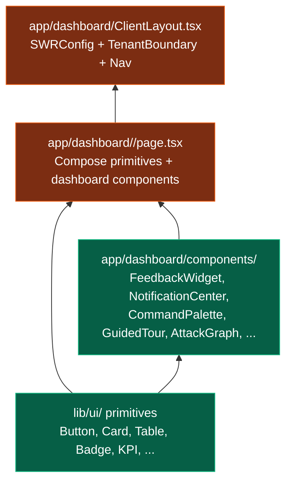
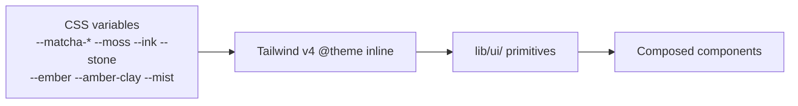
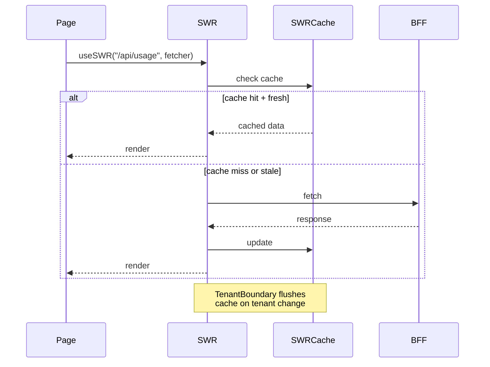
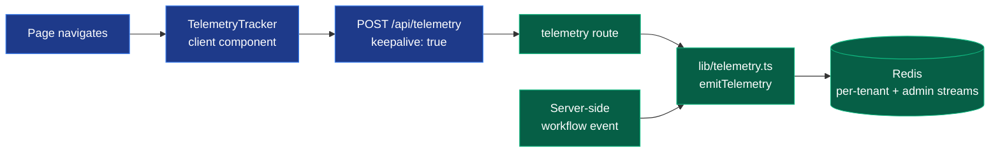
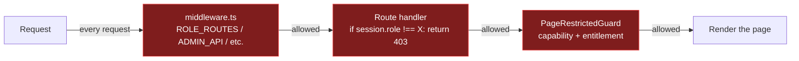

# Frontend Architecture Map

> How the `app/` and `lib/` directories are organized, and the patterns that recur across them.

## Directory layout

```
app/
├── (marketing)/         Unauthenticated marketing pages
│   ├── components/      Marketing-specific React components
│   ├── trust/           Trust center
│   ├── how-it-works/
│   ├── for-cloud-teams/
│   ├── for-mssps/
│   ├── request-demo/    Lead capture (qualified form)
│   ├── pilot-application/
│   ├── waitlist/        Lead capture (minimal form)
│   └── ...              About, pricing, privacy, terms, etc.
├── dashboard/           Authenticated dashboard
│   ├── ClientLayout.tsx Top-level layout with nav + widgets
│   ├── components/      Dashboard-specific React components
│   ├── admin/           ADMIN-only operational consoles
│   │   ├── operations/    Tenant quota + Go health
│   │   ├── platform/      Tenant + storage summary
│   │   ├── trace/         Request id → log correlation tool
│   │   ├── feedback/      Cross-tenant feedback inbox
│   │   ├── insights/      Product telemetry rollup
│   │   ├── commercial/    Per-tenant plan + usage + lifecycle
│   │   ├── leads/         Marketing lead inbox
│   │   └── pilot-health/  Per-tenant pilot risk view
│   ├── findings/, attack-graph/, incidents/, queue/, soc/, executive/, exports/, plan/, ...
│   └── error.tsx        Top-level error boundary
├── api/                 BFF routes (server-side)
│   ├── auth/            Login, register, refresh, logout
│   ├── admin/           ADMIN-only routes
│   ├── feedback/        Authenticated feedback POST
│   ├── leads/           Public lead capture POST
│   ├── telemetry/       Client-side telemetry ingest
│   ├── usage/           Tenant usage summary
│   └── ...              Per-resource routes
├── login/               Auth UI
├── onboarding/          Post-registration flow
└── error.tsx            Top-level error boundary

lib/
├── ui/                  Design primitives (typed)
│   ├── Button, Card, Table, Badge, KPI, Skeleton,
│   ├── EmptyState, ErrorState, FilterBar, Timeline,
│   ├── PageShell, Section, Stack, StatusDot, Stat
│   └── DegradedBanner
├── auth.ts              Session signing + verification
├── plans.ts             Plan-tier catalog (data)
├── rbac.ts              Capability matrix per role
├── usage-accounting.ts  Per-tenant monthly counters
├── lifecycle.ts         Lifecycle stage derivation
├── telemetry.ts         Event taxonomy + emission
├── feedback.ts          Feedback inbox storage
├── leads.ts             Lead capture storage
├── webhook-dispatch.ts  Outbound webhook with retry
├── notify.ts            In-app + email notification fan-out
├── incidents.ts         Incident workflow model
├── demo.ts              Demo-mode flag + reset utility
├── demo-data.ts         Synthetic data for local dev
├── bff-log.ts           authedRoute + proxyRoute + logging
├── env.ts               Required env validation
├── jit-secret.ts        JIT token minting
├── swr-fetcher.ts       Typed fetch wrapper
├── use-session.ts       Client session hook
└── ...                  50+ more typed modules
```

## Routing model

```mermaid
flowchart TB
    Request[HTTP request] --> Middleware{middleware.ts}

    Middleware -->|Public path| Public[Marketing /<br/>public assets /<br/>login]
    Middleware -->|API path| API{API path<br/>classification}
    Middleware -->|Dashboard path| Dash[Dashboard pages<br/>+ ROLE_ROUTES check]

    API -->|Public API| PubAPI[/api/leads /<br/>/api/marketing/* /<br/>/api/auth/login]
    API -->|Admin API| AdmAPI[/api/admin/*<br/>+ session.role === ADMIN]
    API -->|Secops API| SecAPI[/api/scan /<br/>/api/remediate /<br/>/api/aria/*]
    API -->|Auditor API| AudAPI[/api/findings /<br/>/api/audit-trail]
    API -->|Authenticated| AuthAPI[Any signed session]

    Dash --> Layout[ClientLayout]
    Layout --> Nav[DashboardNav<br/>+ role-gated entries]
    Layout --> PageGuard[PageRestrictedGuard]
    PageGuard --> Page[Per-feature page]

    classDef edge fill:#1e3a8a,stroke:#3b82f6,color:#fff
    classDef route fill:#065f46,stroke:#10b981,color:#fff
    classDef layout fill:#7c2d12,stroke:#ea580c,color:#fff

    class Middleware,Public edge
    class PubAPI,AdmAPI,SecAPI,AudAPI,AuthAPI route
    class Layout,Nav,PageGuard,Page layout
```

`ROLE_ROUTES` in `lib/auth.ts` is the declarative source for dashboard route → allowed roles. Adding a new role-restricted dashboard route is a single object entry.

## Component layers



**Rule:** new pages are composed of primitives + dashboard components — no bespoke layout code. A typical page is:

```tsx
<PageRestrictedGuard capability="...">
  <PageShell title="..." description="...">
    <HStack gap="md"><KPI /><KPI /><KPI /></HStack>
    <Card>
      <CardHeader title="..." />
      <Table />
    </Card>
  </PageShell>
</PageRestrictedGuard>
```

## Design system



Theme is data. Adding a dark mode variant or per-tenant brand color is a CSS variable change — no component code touched.

## Client-side state model



SWR keys are URL strings. Per-route revalidation interval is configurable (typically 30-60 seconds for operational views, 5 minutes for static reads).

## Telemetry hook flow



Client emits page_view + interaction events. Server emits workflow + admin events directly (no round-trip). All emissions are fail-open — Redis-down drops events silently.

## RBAC enforcement layers



Three gates in series. A bug in any one is contained by the other two. Defense in depth is the design.

## Demo mode

```mermaid
flowchart LR
    Env[DEMO_MODE=true] --> isDemoMode[lib/demo.ts<br/>isDemoMode]
    isDemoMode --> Route[/api/admin/demo-reset]
    isDemoMode -.may surface UI hints.-> Page[Dashboard pages]

    classDef demo fill:#1f2937,stroke:#9ca3af,color:#d1d5db
    class Env,isDemoMode,Route,Page demo
```

Production deployments do NOT set DEMO_MODE. The reset endpoint returns 404 outside demo mode — even its existence is hidden.

## Onboarding flow

```mermaid
flowchart LR
    Magic[Magic-link email] --> Welcome[/onboarding/welcome]
    Welcome --> Role[Role selection<br/>optional]
    Role --> Dash[/dashboard]
    Dash --> Tour{First-time?}
    Tour -->|yes| Guided[GuidedTour overlay<br/>5 steps]
    Tour -->|no| Normal[Normal dashboard]
    Dash -.may need.-> Cred[/dashboard/credentials<br/>connect AWS / Azure / GCP]
    Cred --> Scan[First scan starts]
    Scan --> Findings[Findings populate]

    classDef milestone fill:#065f46,stroke:#10b981,color:#fff
    class Magic,Welcome,Dash,Guided,Cred,Scan,Findings milestone
```

Each milestone corresponds to an `onboarding.*` telemetry event in `lib/telemetry.ts`. The lifecycle stage derivation in `lib/lifecycle.ts` reads these events to compute "signed_up / activating / activated / engaged."

## Admin dashboards

The founder operational surfaces, mounted under `/dashboard/admin/`:

| Route | Purpose | Data source |
|---|---|---|
| `/admin/operations` | Per-tenant quota + Go API health | `lib/tenant-quota.ts` + Go `/healthz` |
| `/admin/platform` | Aggregate tenant + storage | `lib/users.ts` |
| `/admin/trace` | Request id correlation tool | Static UI |
| `/admin/feedback` | Cross-tenant feedback inbox | `lib/feedback.ts` |
| `/admin/insights` | Product telemetry rollup | `lib/telemetry.ts` |
| `/admin/commercial` | Per-tenant plan + usage + lifecycle | `lib/plans` + `lib/usage-accounting` + `lib/lifecycle` |
| `/admin/leads` | Marketing lead inbox | `lib/leads.ts` |
| `/admin/pilot-health` | Per-tenant pilot risk | Combined: lifecycle + usage + feedback |
| `/admin/health-aggregate` | Platform-wide health rollup | Redis + Go API checks |
| `/admin/deployment-verify` | Deploy readiness check | `lib/env` + Redis + Go API |

All are gated by `capability="manageSettings"` (= ADMIN role). Each has a paired `/api/admin/<name>` route with the per-handler `session.role !== "ADMIN"` check as defense in depth.

## Module boundaries

Two important boundaries to know:

1. **`lib/ui/` exports only primitives, no business logic.** A primitive depends on Tailwind + React + design tokens. It does NOT depend on `lib/auth.ts` or any other business module.

2. **`lib/` modules can import each other freely** but should not create circular dependencies. The dependency map in [`DEPENDENCY_MAP.md`](./DEPENDENCY_MAP.md) shows the current state.

## Where to dig next

- For per-flow detail: [`TELEMETRY_AND_WORKFLOWS.md`](./TELEMETRY_AND_WORKFLOWS.md)
- For the auth + tenant model: [`AUTH_AND_TENANT.md`](./AUTH_AND_TENANT.md)
- For module dependencies: [`DEPENDENCY_MAP.md`](./DEPENDENCY_MAP.md)

Last reviewed: 2026-05-23 (Phase 23).
