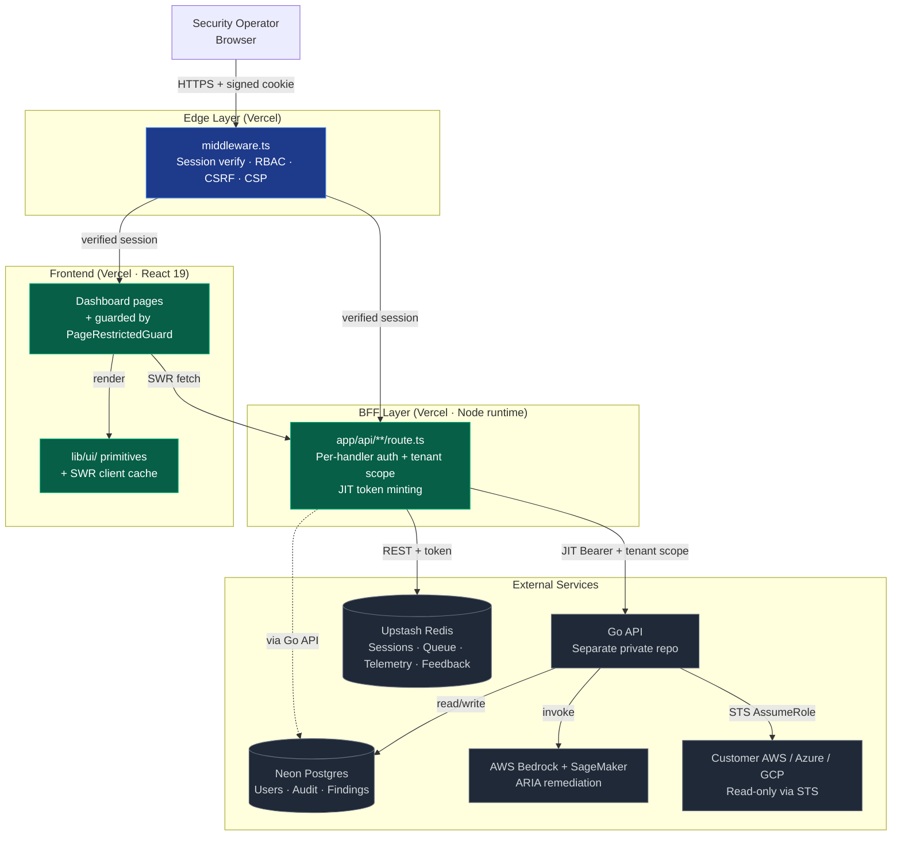
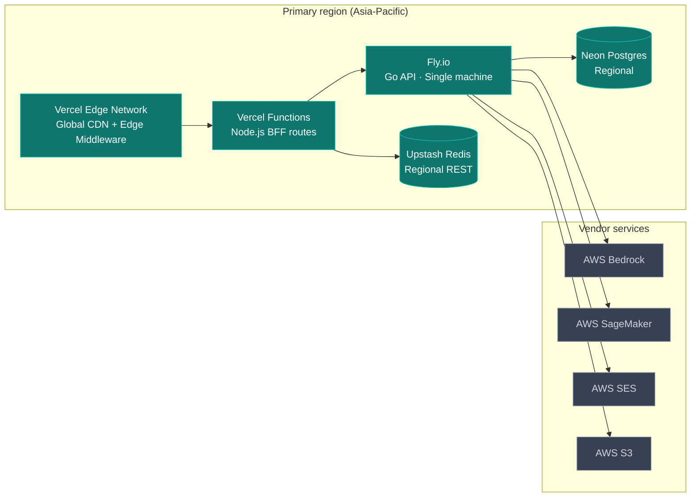
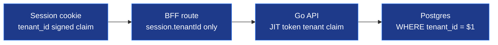
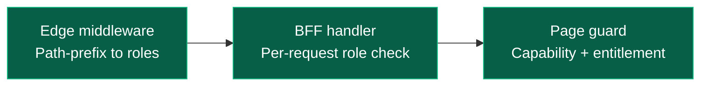
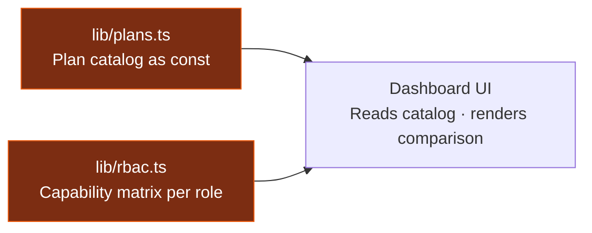
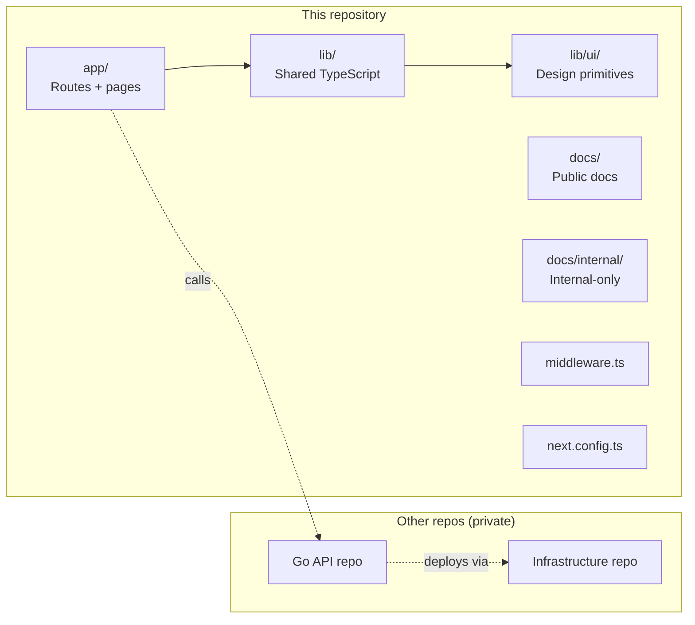

# System Overview

> The 15-minute version: what Tricognita is, how the pieces fit, and why the architecture looks like it does.

## What you're looking at

Tricognita is a multi-tenant cloud security posture management (CSPM) platform with AI-assisted remediation. This repository is the **public frontend** — a Next.js dashboard and BFF (backend-for-frontend) that fronts a separate Go API.

## High-level architecture

### Reading the diagram

- **Edge layer** runs on every request. Session verification + role check happen here, before any application code.
- **BFF layer** is where tenant-scoped business logic lives. Routes mint short-lived JIT tokens to call the Go API.
- **Frontend** is React components rendered server-side then hydrated. SWR handles the client cache.
- **External services** are deliberate boundaries — the Go API, the customer's cloud, the AWS AI services. The frontend repo never reaches across them directly.

## Runtime topology

## Tech stack and why

| Layer | Choice | Why |
|---|---|---|
| Framework | Next.js 16 App Router | File-system routing matches the security model; edge middleware enables auth at the edge |
| UI library | React 19 + React Compiler | Compiler purity catches render bugs at lint time |
| Type safety | TypeScript strict | No `any`, contract drift caught at build |
| Styling | Tailwind v4 + CSS-variable tokens | Theme as data; dark mode + brand customization without code branches |
| Client cache | SWR | Per-key cache + focus/reconnect revalidation matches operator dashboard patterns |
| Server runtime | Node.js (Vercel Functions) | Stable, broad library support, fast enough for BFF needs |
| Edge runtime | Vercel Edge | Sub-millisecond session verification |
| Session signing | HMAC-SHA256 | Stateless verification; revocation handled in Redis |
| Webhook signing | HMAC-SHA256 (Stripe-style) | Industry-standard customer verification flow |
| Cache + queue | Upstash Redis REST | Edge-compatible; no connection pooling complexity |
| Primary database | Neon Postgres | Serverless with branching; regional |
| AI inference | AWS Bedrock + SageMaker | Managed; no model hosting on our side |
| Customer cloud access | AWS STS AssumeRole | Read-only; no long-lived credentials cross the boundary |

## Three load-bearing patterns

These three are how every other design choice flows. If you understand only three things about the architecture, understand these.

### 1. Tenant isolation at four layers

A bug in any **one** layer is contained by the other three. A cross-tenant leak would require simultaneous failures in all four.

### 2. Three-layer RBAC

`ROLE_ROUTES` in `lib/auth.ts` is the single declarative source for dashboard route permissions.

### 3. Plans-as-data, capabilities-as-data

Adding a plan tier or capability is one object edit. The UI renders comparison + upgrade prompts from the catalog without bespoke per-tier code.

## What lives where

The frontend is intentionally self-contained. It can run end-to-end against synthetic demo data in `lib/demo-data.ts` with no real cloud connection.

## What you can do from here

- Read [`FRONTEND_MAP.md`](./FRONTEND_MAP.md) for how the app/ + lib/ directories are organized.
- Read [`AUTH_AND_TENANT.md`](./AUTH_AND_TENANT.md) for the security model in detail.
- Read [`TELEMETRY_AND_WORKFLOWS.md`](./TELEMETRY_AND_WORKFLOWS.md) for how workflows execute.
- Read [`DEPENDENCY_MAP.md`](./DEPENDENCY_MAP.md) for how modules depend on each other.

Last reviewed: 2026-05-23 (Phase 23).
