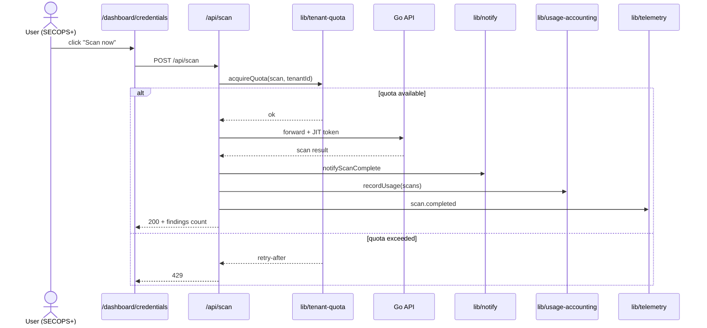
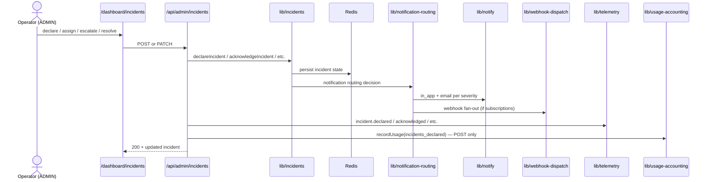
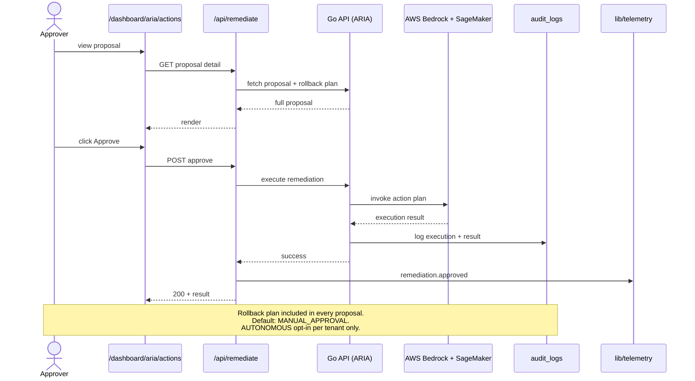
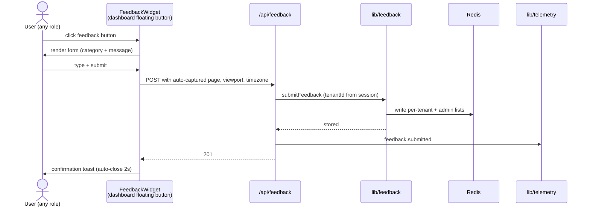
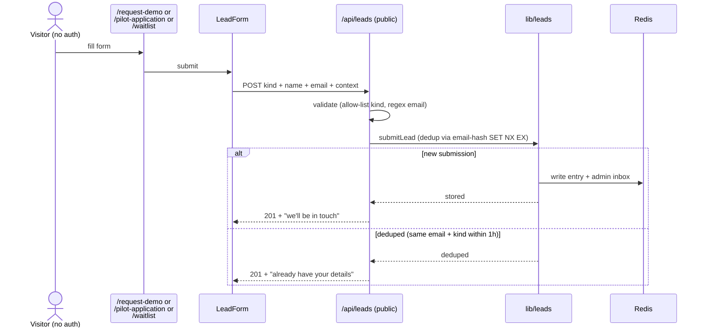
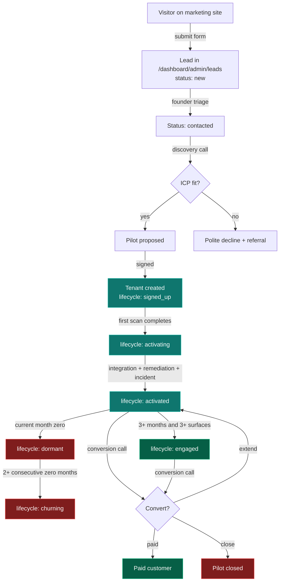

# Telemetry + Workflow Maps

> How telemetry flows through the system, and how the major user-facing workflows execute end-to-end.

## Telemetry architecture

```mermaid
flowchart TB
    subgraph Sources["Event sources"]
        Client[Client-side<br/>page_view + interactions<br/>via TelemetryTracker]
        Server[Server-side<br/>workflow events<br/>direct emitTelemetry call]
    end

    subgraph Validation["Validation + scope"]
        Route[/api/telemetry<br/>allow-list check<br/>data sanitize]
        Direct[Internal call path<br/>tenantId from verified session]
    end

    subgraph Lib["lib/telemetry.ts"]
        Emit[emitTelemetry<br/>fail-open]
        Hash[user_hash =<br/>SHA-256 truncated 16 chars]
    end

    subgraph Storage["Redis storage"]
        Raw[Raw stream LTRIM 5000]
        Tenant[Per-tenant stream LTRIM 1000]
        Daily[Daily aggregate hash<br/>TTL 90 days]
        Tenants[Active tenants set<br/>TTL 90 days]
        Users[Active users set<br/>TTL 90 days]
        Feature[Feature last-seen<br/>per event type]
    end

    subgraph Consumers["Read paths (ADMIN-only)"]
        Insights[/api/admin/insights<br/>+ /dashboard/admin/insights]
    end

    Client --> Route --> Emit
    Server --> Direct --> Emit
    Emit --> Hash --> Raw
    Hash --> Tenant
    Hash --> Daily
    Hash --> Tenants
    Hash --> Users
    Hash --> Feature
    Daily --> Insights
    Tenants --> Insights
    Users --> Insights
    Feature --> Insights

    classDef src fill:#1e3a8a,stroke:#3b82f6,color:#fff
    classDef val fill:#7f1d1d,stroke:#ef4444,color:#fff
    classDef lib fill:#065f46,stroke:#10b981,color:#fff
    classDef store fill:#7c2d12,stroke:#ea580c,color:#fff
    classDef cons fill:#0f766e,stroke:#14b8a6,color:#fff

    class Client,Server src
    class Route,Direct val
    class Emit,Hash lib
    class Raw,Tenant,Daily,Tenants,Users,Feature store
    class Insights cons
```

**Privacy properties:**

- No plaintext email — only `user_hash` (one-way truncated SHA-256).
- No IP address.
- No cookies / localStorage contents.
- No mouse / scroll / form contents.
- No third-party SDK loaded.

**Retention properties:**

- Raw stream: ~7 days at typical load (LTRIM 5000).
- Per-tenant stream: ~30 days at typical tenant load (LTRIM 1000).
- Daily aggregates: 90 days (Redis EXPIRE).
- Feature last-seen: until next emission of that type.

**Failure properties:**

- Redis-down → emissions dropped silently, logged at warn.
- User actions NEVER blocked by telemetry write failure.

For the full event taxonomy + governance rules see [`docs/TELEMETRY_GOVERNANCE.md`](../TELEMETRY_GOVERNANCE.md).

## Workflow maps

Each workflow below: **trigger → flow → output**, with the roles involved, the APIs touched, and the telemetry emitted.

### Scan workflow



**Roles:** SECOPS, SOC_LEAD, DEVSECOPS, ADMIN (anyone who can trigger a scan).
**APIs touched:** `/api/scan` → Go `/api/scan`.
**Telemetry emitted:** `scan.completed` OR `scan.failed`.
**Usage counters:** `scans`.

### Incident workflow



**Roles:** ADMIN.
**APIs touched:** `/api/admin/incidents`.
**Telemetry emitted:** `incident.declared`, `incident.acknowledged`, `incident.assigned`, `incident.escalated`, `incident.resolved`, `incident.noted`.
**Usage counters:** `incidents_declared` (on POST only).

### Remediation approval workflow



**Roles:** SECOPS, ADMIN.
**APIs touched:** `/api/remediate`, `/api/aria/actions`.
**Telemetry emitted:** `remediation.proposed_viewed`, `remediation.approved`, `remediation.rejected`.
**Usage counters:** `remediations_approved`.

### Feedback capture workflow



**Roles:** any authenticated user.
**APIs touched:** `/api/feedback`.
**Telemetry emitted:** `feedback.submitted`.

### Lead capture workflow (unauthenticated)



**Roles:** none (public route).
**APIs touched:** `/api/leads`.
**Telemetry emitted:** none (capturing visitor identity beyond what they submit would violate the privacy posture).

### Pilot lifecycle workflow



**Roles:** ADMIN (founder operates the funnel via `/dashboard/admin/leads` → `/dashboard/admin/pilot-health` → `/dashboard/admin/commercial`).
**APIs touched:** `/api/admin/leads`, `/api/admin/pilot-health`, `/api/admin/commercial`.
**Telemetry emitted:** various per stage transition.
**Lifecycle stage** derived from usage signals — see [`docs/PRICING_MODEL.md §4`](../PRICING_MODEL.md) for thresholds.

### Commercial lifecycle workflow

```mermaid
flowchart LR
    Pilot[Pilot signed<br/>Free plan] -->|conversion| Starter[Starter / Professional]
    Starter -->|outgrows quotas or features| Pro[Professional / Enterprise]
    Pro -->|outgrows or asks for special terms| Ent[Enterprise]
    Ent -.contract end.-> Renewal{Renew?}
    Renewal -->|yes| Ent
    Renewal -->|no| Cancel[Cancellation<br/>30-day grace]
    Cancel --> Delete[Data deletion<br/>per regulatory window]

    classDef tier fill:#1e3a8a,stroke:#3b82f6,color:#fff
    classDef end_ fill:#7f1d1d,stroke:#ef4444,color:#fff

    class Pilot,Starter,Pro,Ent tier
    class Cancel,Delete end_
```



**Roles:** ADMIN (founder for tier changes today; self-serve in Phase 18+).
**APIs touched:** `/api/admin/users` (for plan updates), `/api/usage` (customer view), `/api/admin/commercial` (founder view).
**Telemetry emitted:** plan-change events (when Phase 18+ self-serve ships).

## Cross-workflow observation

All workflows share three properties by design:

1. **Tenant scope from session** — every BFF route reads `session.tenantId`, never from body or query.
2. **Audit-logged** — every state change writes to `audit_logs` (via the Go API for customer data, via `emitAuditEvent` for BFF-only events).
3. **Fail-open telemetry** — Redis failure never blocks the user action; telemetry write is fire-and-forget.

These properties hold across every workflow above and across new workflows added later.

## Where to dig next

- For the auth + session detail: [`AUTH_AND_TENANT.md`](./AUTH_AND_TENANT.md)
- For module dependencies: [`DEPENDENCY_MAP.md`](./DEPENDENCY_MAP.md)
- For the public workflow engine description: [`docs/WORKFLOW_ENGINE.md`](../WORKFLOW_ENGINE.md)

Last reviewed: 2026-05-23 (Phase 23).
